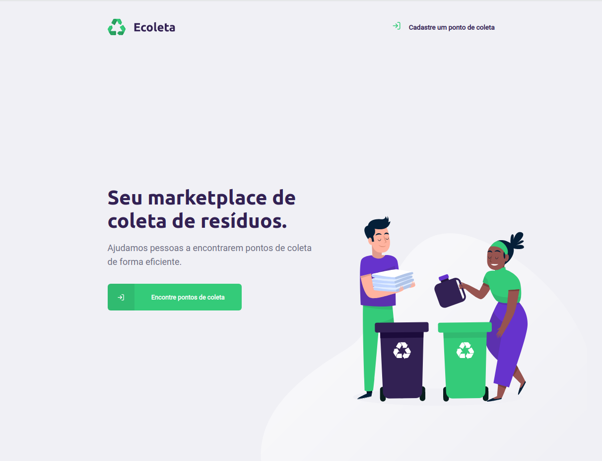
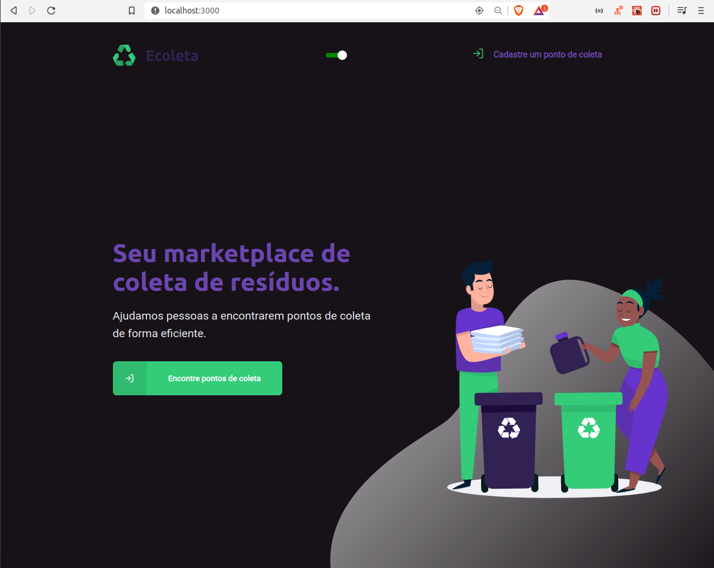
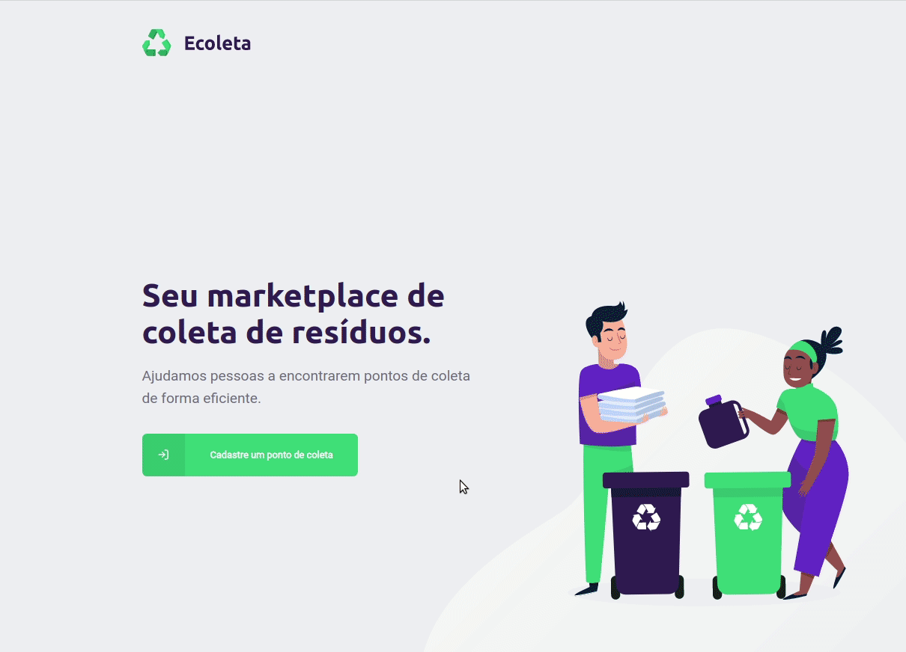

# Ecoleta (Sistema De Coleta)

#### Linguagens: <a href="https://github.com/MarcusMartins38/SistemaDeColeta-NLW01">English<a/> ou Português  

<p align="center">


</p>

## Sumary
[Intro](#intro) :door:  
[Como a aplicação funciona](#como-a-aplicação-funciona) :open_book:  
[Tecnologias](#tecnologias) :computer:  
[Como posso testar ?](#como-posso-testar-) :open_book: 

## Intro

**Obs: Eu fiz algumas alterações, aplicando algumas das minhas ideias, para ser, de alguma maneira, diferente dos outros projetos e para melhorar minhas skills. Provavelmente eu vou fazer mais algumas alterações hehe.**

Next Level Week é um novo evento para descobrir **o poder de algumas tecnologias e ferramentas, aprender novos conceitos e adquirir novas skills**. Durantes essa semana intensa, nós temos acesso a um conteudo **focado na prática** de tecnologias que são usadas por grandes empresas como Facebook, Netflix, Airbnb e muitas outras. Além de ter um acesso a uma **comunidade exclusiva** com instrutores da Rocketseat e milhares de outros desenvolvedores. As principais tecnologias usadas nesse evento são:

- Node.js para back-end;
- React.js para front-end Web;
- React Native para mobile.

Nós desenvolvemos uma aplicação chamada **Ecoleta** onde o propósito desse projeto, é ajudas as pessoas a encontrarem pontos de coleta de uma forma mais fácil

## Como a aplicação funciona
Na versão web da aplicação, você pode registrar um ponto de coleta. Além de poder ver os pontos de coleta registrados por estado, e algumas informações sobre os mesmos.

<p align="center">

</p>

E no mobile, você pode ver a localização em um mapa, e algumas informações do estabelecimento, apenas clicando na imagem deles.

<p align="center">

</p>

## Tecnologias

Esse projeto foi desenvolvido com as seguintes tecnologias:  

### NodeJs (TypeScript)

- celebrate
- cors
- express
- knex
- sqlite3
- multer
- ts-node

### ReactJs (TypeScript)

- axios
- leaflet
- react-icons
- react-router-dom
- react-dropzone
- react-icons
- react-leaflet
- react-toastify

### React Native (Usando Expo)(TypeScript)

- axios
- expo-constants
- expo-font
- expo-location
- expo-mail-composer
- react-native-safe-area-context
- react-native-svg

## Como posso testar ?

Você vai precisar ter o Node.js para rodar

### Passos

Com Yarn
```
$ git clone https://github.com/MarcusMartins38/SistemaDeColeta-NLW01.git
$ cd SistemaDeColeta-NLW01/backend
$ yarn
$ yarn dev
$ cd SistemaDeColeta-NLW01/frontend ou cd SistemaDeColeta-NLW01/mobile
$ yarn
$ yarn start
```

Com Npm

```
$ git clone https://github.com/MarcusMartins38/SistemaDeColeta-NLW01.git
$ cd SistemaDeColeta-NLW01/backend
$ npm install
$ npm dev
$ cd SistemaDeColeta-NLW01/frontend ou cd GoBarberApplication/appgobarber
$ npm install
$ npm start
```
